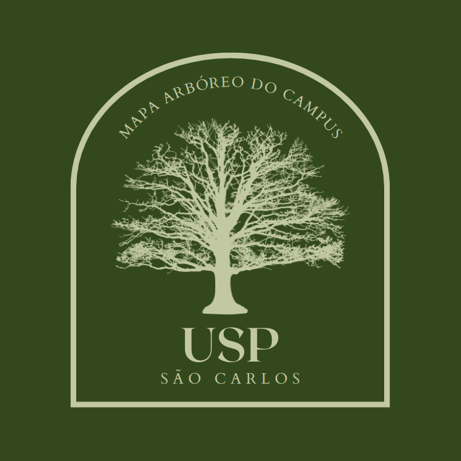

# 

## Equipe: As Arvores São Nozes

## Descrição do Projeto

O Catálogo Arbóreo do CAASO (USP São Carlos) é uma aplicação desenvolvida com o objetivo de catalogar as árvores presentes no campus. Através do registro de informações como espécie, nome popular, localização, situação e ID, a plataforma visa facilitar o planejamento urbano e a preservação das árvores em nosso campus.

## Time

- Guilherme Sousa Panza - guilherme.panza@usp.br - Dev
- João Antonio Misson Milhorim - joao.misson@usp.br - Scrum Master
- Maria Júlia Soares De Grandi - maju.degrandi@usp.br - Dev
- Pedro Kenzo Muramatsu Carmo - kenzo_muramatsu@usp.br - PO
- Theo Bruno Frey Riffel - theobfriffel@usp.br - Dev
- Arthur Vergaças Daher Martins - arthur.vergacas@usp.br - Dev

## Contato

Para qualquer dúvida ou informação adicional, você pode entrar em contato conosco pelo email: catlogo-arboreo@usp.br.

## Esquema do Banco de Dados

O banco de dados utilizado para o Catálogo Arbóreo é o PostgreSQL. O esquema utilizado é o seguinte:

```
CREATE TABLE arvores (
  id SERIAL PRIMARY KEY,
  especie VARCHAR(255) NOT NULL,
  nome_popular VARCHAR(255) NOT NULL,
  localizacao VARCHAR(255) NOT NULL,
  situacao VARCHAR(255) NOT NULL,
  ultima_inspecao DATE NOT NULL
);
```

## Mock no Figma

Você pode acessar o mock do Catálogo Arbóreo no Figma através deste [link](https://www.figma.com/file/nELCTpE7ZvXWYxilDbw0Jv/Cat%C3%A1logo-Arb%C3%B3reo-do-CAASO?type=design&node-id=0%3A1&mode=design&t=FstCbxsou99JdYpk-1).

## Agradecimentos

Gostaríamos de expressar nosso agradecimento especial à Professora Simone por sua orientação e suporte ao longo do desenvolvimento deste projeto. Também agradecemos à Sônia, arquiteta do campus, por fornecer as informações e insights necessários para a criação do Catálogo Arbóreo do CAASO.

## Licença

Este projeto está licenciado sob a [MIT License](LICENSE).
